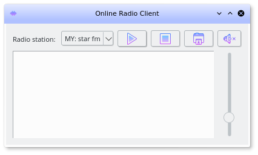

# qt5radio
A simple GUI interface for playing online radio station. Allows one to
record stream into mp3.

GUI is based on PyQt5, and audio playback related functionalities are
based on GStreamer (pygst). 

## Installing
1. Clone the repo
2. Populate stations.py with the description and URL of the online radio
   station
3. pip3 install -r requirements.txt

Either
4. python3 setup.py install
5. qt5radio.py

Or

4. simply run ./qt5radio.py

## Running
1. Run the program
2. For now, the recordings are saved to the directory which the
   command is executed.

## Limitations
Program is distributed in the hope that it will be useful, but WITHOUT
ANY WARRANTY.

## Screenshot

